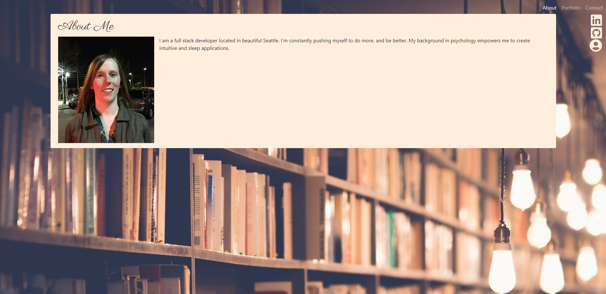

# Responsive-Portfolio

## About

This is my portfolio. It goes with a mobile-first design and showcases some of my current work. It was built with HTML, CSS, Javascript, and Bootstrap. The resume is in the sidebar as the third icon.

## Link to the GitHub Repos
https://github.com/CodySamuels/responsive-portfolio/

https://codysamuels.github.io/responsive-portfolio/

https://github.com/CodySamuels/weather-dashboard

https://codysamuels.github.io/weather-dashboard/

https://github.com/CodySamuels/daily-planner/

https://codysamuels.github.io/daily-planner/